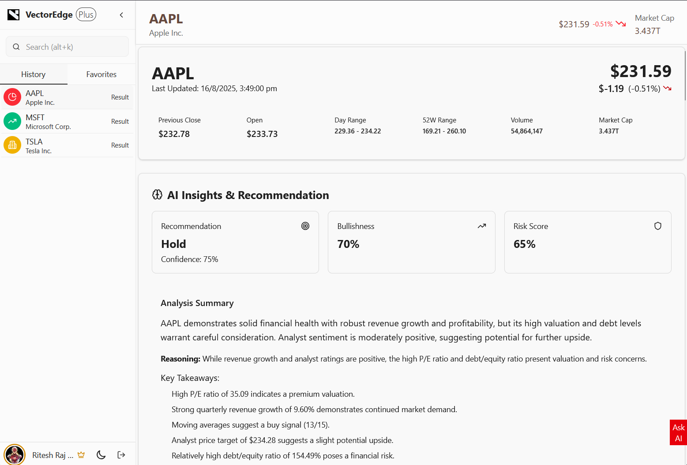
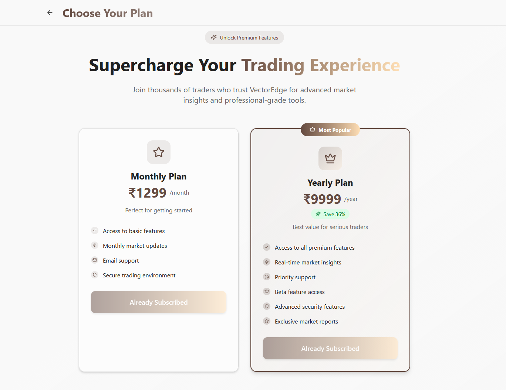

<div align="center">
  
  <h1 align="center">Vectoredge Pro</h1>
  <p align="center">
    A powerful, AI-driven stock analysis platform.
  </p>
  <p align="center">
    <a href="https://vector-edge-wheat.vercel.app/" target="_blank"><strong>Live Demo »</strong></a>
  </p>
</div>

---

## 🚀 Introduction

Vectoredge Pro is a modern, AI-powered web application designed to provide users with comprehensive stock analysis and insights. It leverages cutting-edge technologies to scrape financial data from sources like **TradingView** and **Yahoo Finance**, uses **Large Language Models (LLMs)** to process and format the raw data, and then generates valuable insights, also using LLMs. This project showcases a full-stack application with a sophisticated data pipeline, demonstrating skills in web scraping, AI integration, and building a seamless user experience for both novice and experienced investors.

## ✨ Features

*   **AI-Powered Stock Analysis:** Get in-depth stock analysis reports generated by AI. The application scrapes raw data, which is then cleaned, structured, and analyzed by LLMs to provide human-readable insights.
*   **Real-time Stock Data:** Access real-time stock data, including prices, charts, and key metrics.
*   **Comprehensive Search:** Easily search for stocks and other financial instruments.
*   **User Authentication:** Secure user authentication and profile management with Supabase.
*   **Subscription Plans:** Subscription-based access to premium features with Razorpay integration.
*   **AI Chat:** An interactive AI chat to get quick insights and answers to your financial questions.
*   **Responsive Design:** A fully responsive and mobile-friendly user interface.

## 🖼️ Screenshots

<div align="center">
  
  
</div>

## 🛠️ Tech Stack

*   **Frontend:** [Next.js](https://nextjs.org/), [React](https://react.dev/), [TypeScript](https://www.typescriptlang.org/), [Tailwind CSS](https://tailwindcss.com/)
*   **Backend:** [Next.js API Routes](https://nextjs.org/docs/app/building-your-application/routing/route-handlers), [Supabase](https://supabase.com/)
*   **AI & Machine Learning:** [Google Gemini](https://ai.google.dev/), [OpenAI](https://openai.com/)
*   **Web Scraping:** [Puppeteer](https://pptr.dev/), [Cheerio](https://cheerio.js.org/)
*   **Payments:** [Razorpay](https://razorpay.com/)
*   **Deployment:** [Vercel](https://vercel.com/)

## ⚙️ Getting Started

To get a local copy up and running, follow these simple steps.

### Prerequisites

*   Node.js (v20 or later)
*   npm

### Installation

1.  **Clone the repo**
    ```sh
    https://github.com/riteshrajd/VectorEdge
    ```
2.  **Install NPM packages**
    ```sh
    npm install
    ```
3.  **Set up environment variables**

    Create a `.env.local` file in the root of your project and add the following environment variables:

    ```env
    NEXT_PUBLIC_BASE_SERVER_URL=http://localhost:3000

    # Supabase
    NEXT_PUBLIC_SUPABASE_URL=your_supabase_url
    NEXT_PUBLIC_SUPABASE_ANON_KEY=your_supabase_anon_key

    # Razorpay
    RAZORPAY_KEY_ID=your_razorpay_key_id
    RAZORPAY_KEY_SECRET=your_razorpay_key_secret

    # OpenAI
    OPENAI_API_KEY=your_openai_api_key

    # Google Gemini
    GEMINI_API_KEY=your_gemini_api_key
    ```

4.  **Run the development server**
    ```sh
    npm run dev
    ```

    Open [http://localhost:3000](http://localhost:3000) with your browser to see the result.


## 🌐 API Endpoints

The application uses Next.js API Routes to handle backend functionality. Here are some of the key endpoints:

*   `/api/ticker-search`: Searches for stock tickers.
*   `/api/ticker-data`: Fetches data for a specific stock ticker.
*   `/api/razorpay`: Handles Razorpay payment integration.
*   `/api/update-user-data`: Updates user data, such as favorite stocks.

## ⚖️ Disclaimer

The web scraping functionality in this project is for demonstration purposes only. The data is scraped from public sources like **TradingView** and **Yahoo Finance**. Please be aware of the terms of service of these websites before using this project for any purpose other than personal demonstration.

## 👨‍💻 Contact

Ritesh Raj Dwivedi - riteshrajdwivedi@gmail.com

Project Link: [https://github.com/your_username/vectoredge-pro](https://github.com/your_username/vectoredge-pro)