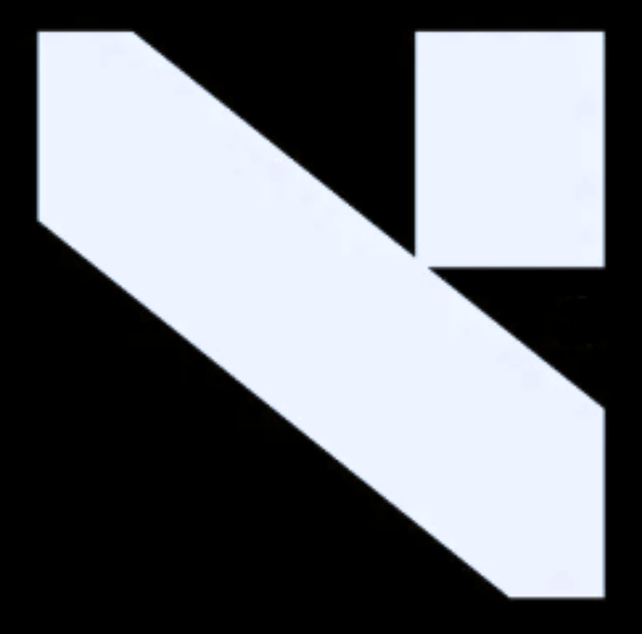
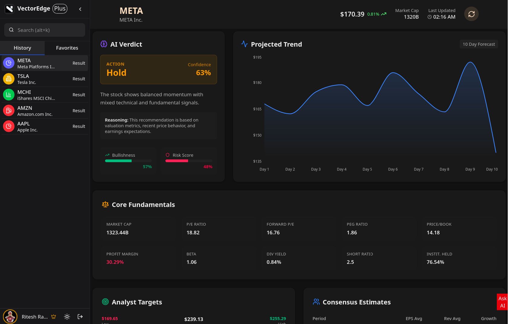
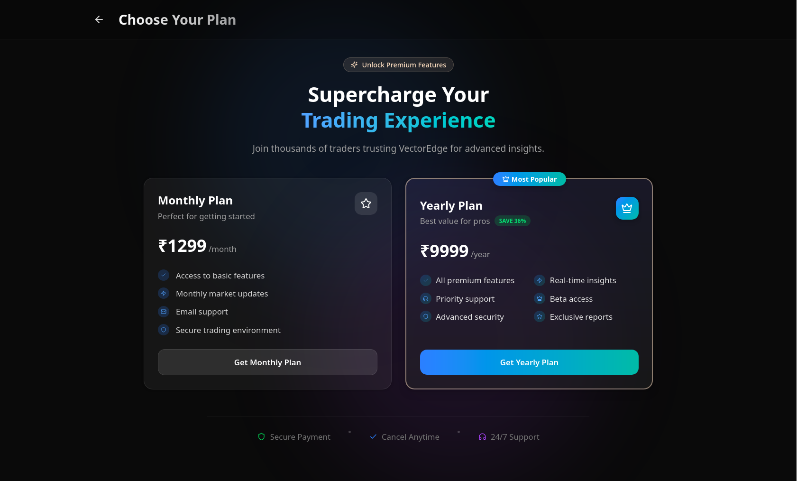

<div align="center">
  
  <h1>VectorEdge</h1>
</div>

---

## Description

**A Platform for stock analysis using AI.**

VectorEdge combines real-time data scraping, distributed background processing, and Large Language Models (LLMs) to deliver institutional-grade financial insights to retail investors.

[**View Live Demo »**](https://vector-edge-wheat.vercel.app/)

> [!NOTE]
> Live demo services may occasionally be inactive or slow due to free-tier limits and cold starts on Render, Upstash Redis, and Supabase. Refer to the screenshots below for the full interface.

---

## Screenshots

<div align="center">
  <p><strong>Stock Analysis Dashboard</strong></p>
  
  <br /><br />
  <p><strong>Subscription & Account Tier</strong></p>
  
</div>

---

## 🚀 Features

* **AI-Powered Analysis:** Raw market data is scraped, cleaned, and analyzed by Google Gemini/OpenAI to generate human-readable investment reports.
* **Real-Time Updates:** WebSocket integration ensures live feedback on analysis progress and stock alerts without page refreshes.
* **Distributed Architecture:** Heavy data processing is offloaded to background workers via Redis queues, ensuring a responsive UI.
* **Smart Caching:** High-performance caching layer prevents redundant processing for popular tickers.
* **Full User Suite:** Authentication (Supabase), Payments (Razorpay), and history management.

## 🛠️ Tech Stack

* **Frontend:** Next.js 14, React, TypeScript, Tailwind CSS
* **Backend:** Next.js API Routes, Node.js (Custom Worker/Socket Server)
* **Database & Auth:** Supabase (PostgreSQL)
* **Queue & Cache:** Redis (Upstash/Local), BullMQ
* **Real-time:** Socket.io
* **AI:** Google Gemini API
* **Infrastructure:** Docker, Vercel, Render

---

## ⚙️ Getting Started

Follow these steps to set up the project locally. You will need to run the database, backend services, and frontend simultaneously.

### Prerequisites

* **Node.js** (v20+)
* **Docker** (for running local Redis)
* **Git**

### 1. Installation

Clone the repository and install dependencies:

```bash
git clone https://github.com/riteshrajd/VectorEdge.git
cd VectorEdge
npm install

```

### 2. Environment Configuration

Create a `.env.local` file in the root directory. Copy and paste the template below, filling in your specific API keys.

```env
# --- Client & Server URLs ---
NEXT_PUBLIC_BASE_SERVER_URL=http://localhost:3000
CLIENT_URL=http://localhost:3000
NEXT_PUBLIC_SOCKET_SERVER_URL=http://localhost:3001
SOCKET_IO_PORT=3001

# --- Database (Supabase) ---
NEXT_PUBLIC_SUPABASE_URL=your_supabase_url
NEXT_PUBLIC_SUPABASE_ANON_KEY=your_anon_key
SUPABASE_SERVICE_ROLE_KEY=your_service_role_key

# --- Payments (Razorpay) ---
NEXT_PUBLIC_RAZORPAY_KEY_ID=your_razorpay_id
RAZORPAY_KEY_SECRET=your_razorpay_secret

# --- AI Models ---
GEMINI_API_URL=[https://generativelanguage.googleapis.com/v1beta/models/gemini-2.0-flash-exp:generateContent](https://generativelanguage.googleapis.com/v1beta/models/gemini-2.0-flash-exp:generateContent)
GEMINI_API_KEY=your_gemini_key

# --- Infrastructure (Redis) ---
# For local dev, use localhost. For prod, use your Upstash URL.
REDIS_URL=redis://localhost:6379

```

### 3. Running Locally

Since VectorEdge uses a microservices-like architecture, you need to run four separate processes.

**Step A: Start Redis (The Backbone)**
Make sure you have Docker running, then spin up a Redis container:

```bash
# Terminal 1
docker-compose up -d
# OR if you don't have a compose file:
# docker run -d -p 6379:6379 redis:alpine

```

**Step B: Start the Background Worker**
This service processes the heavy data scraping and AI analysis jobs.

```bash
# Terminal 2
npx tsx external-services/worker.ts

```

**Step C: Start the Socket Server**
This service handles real-time communication between the Worker and the Frontend.

```bash
# Terminal 3
npx tsx external-services/socket-server.ts

```

**Step D: Start the Frontend**
Launch the Next.js application.

```bash
# Terminal 4
npm run dev

```

Visit `http://localhost:3000` to access the app.

---

## 🌐 API Reference

* **`POST /api/ticker-search`**: Search for stock symbols.
* **`GET /api/ticker-data`**: Check cache or trigger a background job for analysis.
* **`POST /api/razorpay`**: Initialize payment orders.
* **`POST /api/update-user-data`**: Sync user preferences/favorites.

## ⚖️ Disclaimer

This project scrapes data from public sources for educational and demonstration purposes. Please respect the Terms of Service of data providers (TradingView/Yahoo Finance). Not intended for commercial distribution without proper data licensing.

## 👨‍💻 Contact

* **LindedIn** - https://www.linkedin.com/in/ritesh-raj-dwivedi-b720b428b/
* **Gmail** - riteshrajdwivedi@gmail.com
